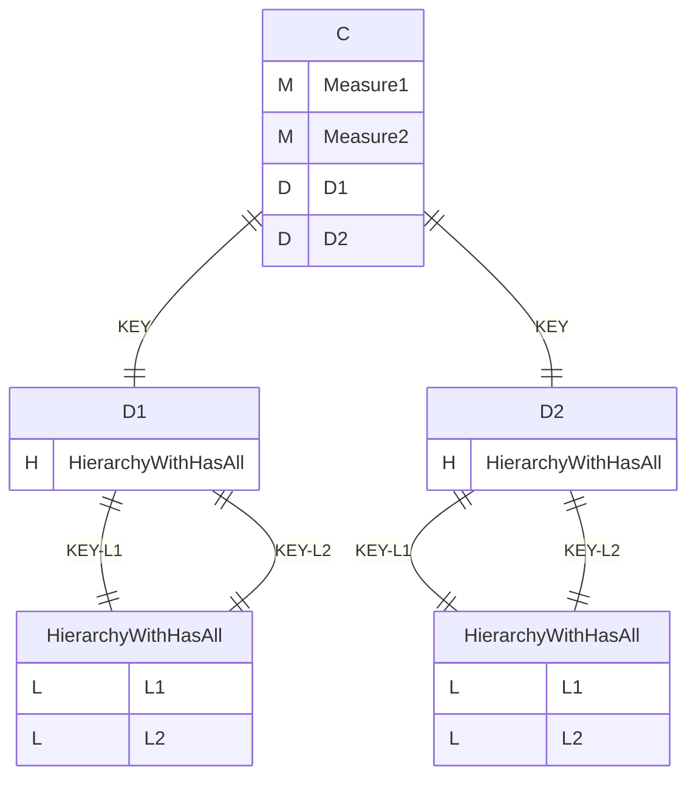
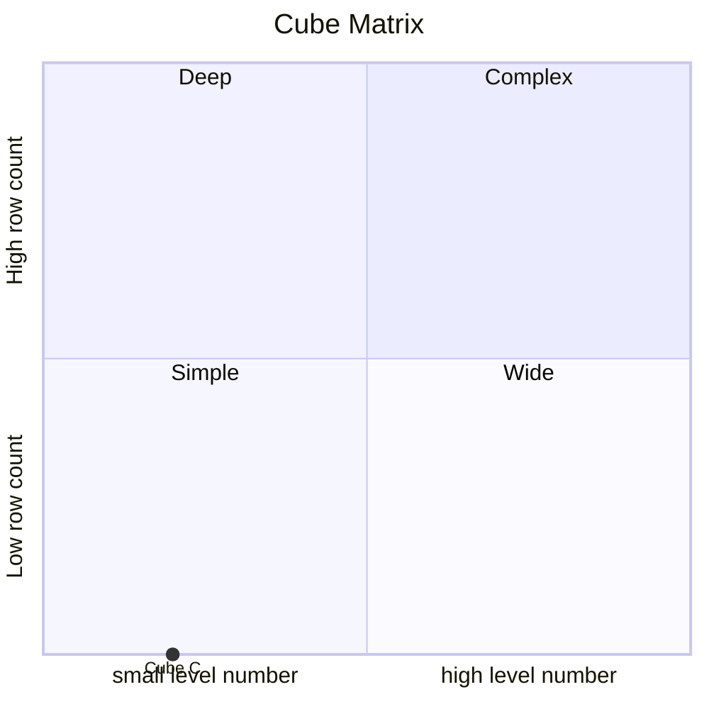
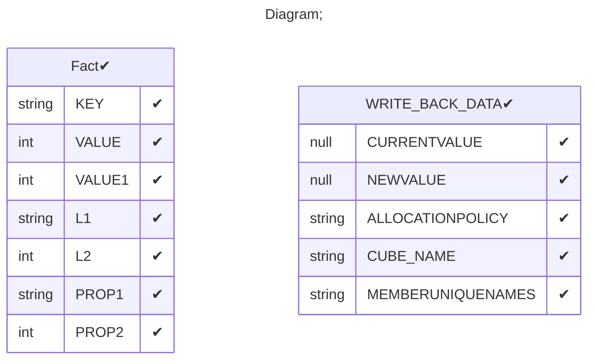

# Documentation
### CatalogName : tutorial_for_writeback_multiple_measure
### Schema tutorial_for_writeback_multiple_measure : 

    

		
  
---
### Cubes :

    C

---
#### Cube "C":

    

##### Table: "Fact"

##### Dimensions:
##### Dimension "D1":

Hierarchies:

    HierarchyWithHasAll

##### Hierarchy HierarchyWithHasAll:

Tables: "Fact"

Levels: "L1, L2"

###### Level "L1" :

    column(s): L1

###### Level "L2" :

    column(s): L2

##### Dimension "D2":

Hierarchies:

    HierarchyWithHasAll

##### Hierarchy HierarchyWithHasAll:

Tables: "Fact"

Levels: "L1, L2"

###### Level "L1" :

    column(s): L1

###### Level "L2" :

    column(s): L2

### Cube "C" diagram:

---

---
### Cube Matrix for tutorial_for_writeback_multiple_measure:

---
### Database :
---

---
## Validation result for schema tutorial_for_writeback_multiple_measure
## WARNING : 
|Type|   |
|----|---|
|DATABASE|Table: Schema must be set|
